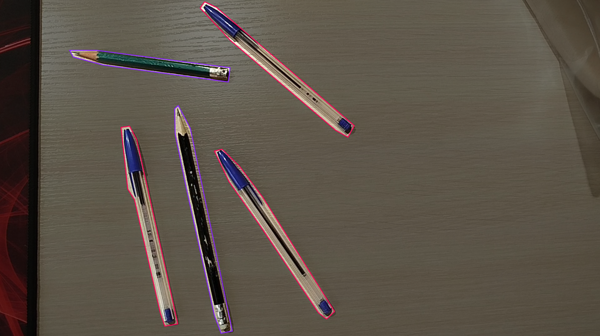
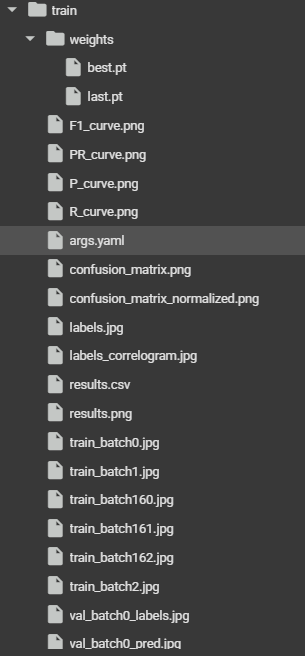
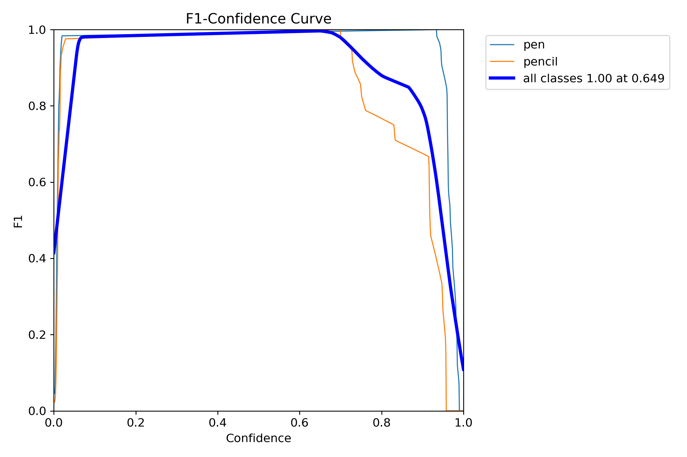
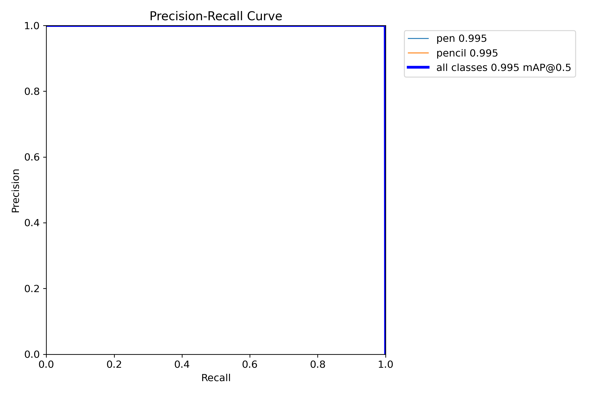

# *Testing task*

Этот проект сделан в рамках тестового задания для трудоустройства  
**Цель проекта - детекция объектов на видео**  

.gif)

## Содержание
- [Постановка задачи](#постановка-задачи)
- [Реализация](#реализация)
- [Тест модели](#тест-модели)
## Постановка задачи
Обучить модель [YOLO][yolo] для детекции карандаша и ручки. 

---

- Собрать данные (положить ручку 1-3 штуки на стол и карандаш 1-3 штуки), записать 2 видео по 30 секунд. Первое видео использовать для тренировки модели. Второе для проверки качества модели. 
- Разметить данные (выбрать 60 фотографий для тренировки), разметить 2 класса ручка/карандаш. Размечать в любом из сервисов (Roboflow, Anylabel, Label-Studio, ...). В train пойдут 50 фотографий, на valid выборку 10 фотографий. 
- Обучить модель YOLO (v8 или v11). Попробовать разные модели (n-nano, s-small). Обучать на видеокарте 
- Оценить метрики. Какая модель лучше? Почему?
- Проверить модель на записанном втором видео. Либо, если есть вебкамера в компьютере/ноутбуке, то попробовать запустить модель в Real-Time.

[yolo]: https://docs.ultralytics.com/ru/models/yolo11/
## Реализация
1. Для начала мною были собраны данные. Для этого были записаны 2 видео (61 секунда и 30 секунд) для тренировки и теста модели. В видео использовались два класса объектов: *карандаш* и *ручка* в количестве 2 и 3 шт. соответственно.

<table>
  <tr>
    <td align="center">
      
       
      <b>Тренировочное видео</b>
    </td>
    <td align="center">
      
       
      <b>Тестовое видео</b>
    </td>
  </tr>
</table>

2. Затем тренировочное видео было размечено в сервисе [Roboflow][roboflow]. Я выбрал данный сервис, так как он обладает разнообразием инструментов для удобной разметки, является бесплатным, а также простым и интуитивно понятным в использовании.

Видео длительностью 1 минута 1 секунда было разделено на 61 кадр (1 кадр/с). На каждом кадре были размечены все объекты двух классов - карандаш и ручка. По итогу мы получили такие размеченные кадры (рисунок 1) в разрешении FullHD с выделенными объектами данных классов:

  
  <b>Рисунок 1. Размеченный кадр</b>

Набор данных доступен по [ссылке][набор-данных]

3. Для выполнения задания была использована модель [YOLOv11][yolov11]. Выбирая между данной версией и версией v8 я опирался на [статью][сравнение], представленную разработчиками Ultralytics, по результатам которой я решил выбрать именну эту модель.

В задании использовались разные варианты данной модели: *nano*, *small*, *medium*, *large*.

Обучение производилось со следующими параметрами: 
- ссылка на yaml-файл (*data*) = **data.yaml** (*данный yaml-файл получен после разметки в сервисе Roboflow*)
- количество эпох(*epochs*) = **50** (*количество циклов прохода модели по всему набору данных*)
- размер изображений(*imgsz*) = **640** (❗ *данный параметр подразумевает изменение изображения самой моделью YOLO до заданного разрешения, если оно не было задано фотографиям до этого*)

По результатам тренировки были сформированы 4 папки с ее результатами каждой из моделей, где находятся графики, два файла с весами (.pt) - последняя эпоха обучения и лучшая эпоха обучения.

  

4. Оценка метрик каждой из моделек производилась на валидационном наборе данных. С помощью соответствующего метода `val()` были автоматически получены метрики и графики каждой из моделей. Некоторые из графиков и сводная таблица метрик моделей представлены ниже.  

Таблица 1: Метрики моделей  
|     | YOLOv11n | YOLOv11s | YOLOv11m | YOLOv11l |  
| --- | --- | --- | --- | --- |  
| Precision |  0.9932 | 0.9963 | 0.9957 | 0.9962 |  
| Recall | 1.0000 | 1.0000 | 1.0000 | 1.0000 | 
| mAP0.5 | 0.9950 | 0.9950 | 0.9950 | 0.9950 |
| map0.5-0.95 | 0.9485 | 0.9634 | 0.9708 | 0.9663 |

Сравним графики F1-кривых каждой из моделей (рисунки 2-5):

<table>
  <tr>
    <td align="center">
       
      <b>Рисунок 2. F1-кривая для nano модели</b>
    </td>
    <td align="center">
       
      <b>Рисунок 3. F1-кривая для small модели</b>
    </td>
  </tr>
  <tr>
    <td align="center">
       
      <b>Рисунок 4. F1-кривая для medium модели</b>
    </td>
    <td align="center">
       
      <b>Рисунок 5. F1-кривая для large модели</b>
    </td>
  </tr>
</table>

Максимальное значение у всех моделей одинаковое. Будем рассматривать лучшимии модели, у которых порог confidence при максимальном значении выше. Это означает, что модель больше уверена в своих предсказаниях. Это модели 2 и 3.

Также оценим графики PR-кривых (рисунки 6-9):

<table>
  <tr>
    <td align="center">
       
      <b>Рисунок 6. PR-кривая для nano модели</b>
    </td>
    <td align="center">
       
      <b>Рисунок 7. PR-кривая для small модели</b>
    </td>
  </tr>
  <tr>
    <td align="center">
       
      <b>Рисунок 8. PR-кривая для medium модели</b>
    </td>
    <td align="center">
       
      <b>Рисунок 9. PR-кривая для large модели</b>
    </td>
  </tr>
</table>

Самая большая площадь под данным графиком у третьей модели, что означает хорошую точность модели при высокой ее полноте. 

По совокупности метрик выбрана третья модель, так как она показала наилучшие результаты.

[roboflow]: https://roboflow.com/
[набор-данных]: https://universe.roboflow.com/diplom2024/testing-task/dataset/2
[yolov11]: https://docs.ultralytics.com/ru/models/yolo11/
[сравнение]: https://docs.ultralytics.com/ru/compare/yolov8-vs-yolo11/#performance-head-to-head-yolov8-vs-yolo11

##  Тест модели
После выбора третьей модели проведен ее тест на предварительно записанном видео

.gif)
